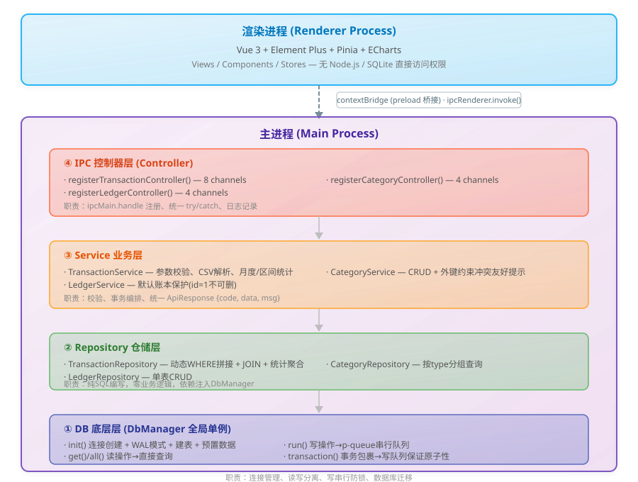
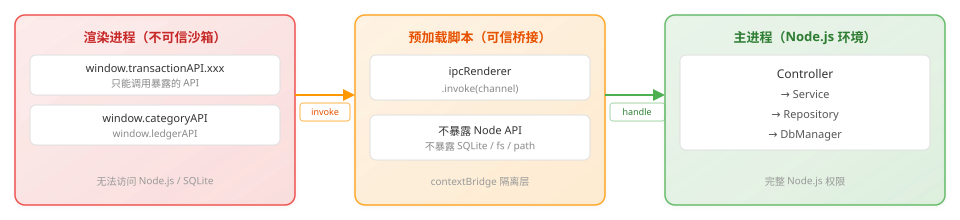
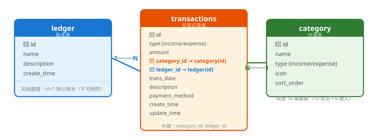
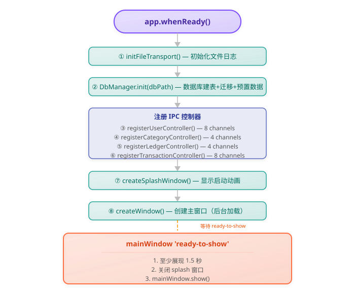
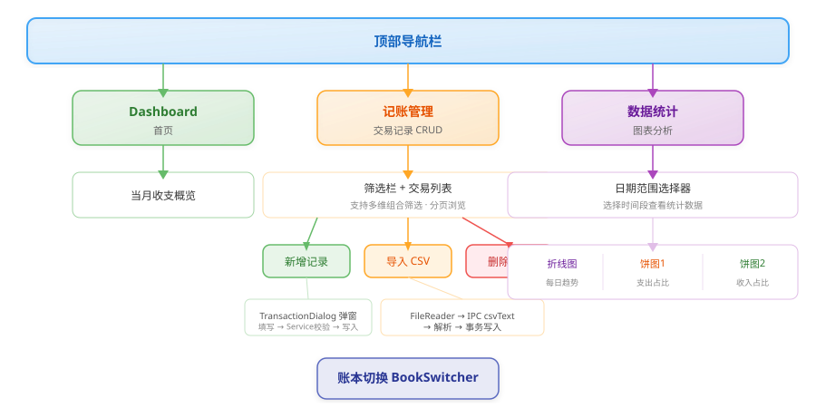
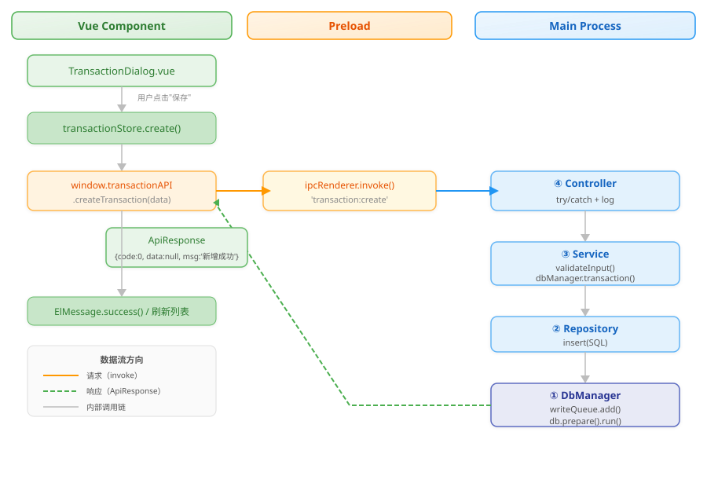

# **个人记账** — 产品需求文档（PRD）

| 文档版本 | 修订日期   | 修订内容                 | 作者   |
| -------- | ---------- | ------------------------ | ------ |
| v1.0     | 2026-07-09 | 基于已交付代码输出完整PRD         | 产品+架构 |
| v1.1     | 2026-07-09 | 移除用户管理模块，精简为纯记账应用 | 产品+架构 |

---

## 1. 产品概述

### 1.1 产品背景

在日常个人财务管理场景中，用户通常使用手机记账 App 记录日常收支，但手机端在**批量编辑、复杂筛选、多维度统计分析、大屏可视化**等方面体验受限。用户导出 CSV 后缺乏桌面端工具进行统一管理、深度分析和集中存储。

「个人记账」是一款基于 Electron 构建的桌面端本地记账工具，旨在提供**离线优先、数据本地化、快速响应**的个人财务管理体验。

### 1.2 解决痛点

| 痛点                     | 解决方案                                                   |
| ------------------------ | ---------------------------------------------------------- |
| 手机端批量操作不便       | 桌面端表格化编辑，支持批量筛选、分页浏览                   |
| CSV 导入后无法整合分析   | 内置 CSV 解析引擎，自动匹配/创建分类，一步导入              |
| 数据存云端，隐私担忧     | 全部数据存储于本地 SQLite 数据库，**零网络传输**           |
| 缺乏可视化统计           | ECharts 每日收支折线图 + 分类占比饼图                      |
| 多人/多场景账本混乱      | 支持多账本独立管理，一键切换                               |

### 1.3 核心优势

- **100% 离线可用**：无需网络连接，所有功能完整运行
- **本地数据存储**：采用 SQLite 数据库，数据完全归属于用户本地文件系统
- **单文件数据库**：数据库位于 `userData` 目录，卸载重装不丢失
- **事务安全**：p-queue 串行写队列 + WAL 模式，杜绝数据库锁定
- **安全隔离**：preload 桥接层隔离渲染进程，前端无法直接操作数据库或文件系统
- **工业级分层架构**：DB → Repository → Service → Controller 四层分离，高可维护、可测试
- **跨平台支持**：Windows（NSIS 安装包） + macOS（DMG/ARM64）

### 1.4 离线能力说明

| 能力项           | 实现方式                               |
| ---------------- | -------------------------------------- |
| 数据持久化       | `better-sqlite3` + `userData` 目录     |
| 数据导入         | 本地 CSV 文件读取，纯 JS 解析          |
| 图表渲染         | ECharts 本地渲染，零网络依赖           |
| 日志记录         | Winston 本地文件日志（自动轮转 5MB×5） |
| 应用更新         | 无自动更新，依赖安装包分发             |
| 通知             | Electron 原生 Notification API         |

---

## 2. 目标用户与使用场景

### 2.1 目标用户画像

| 用户群体       | 特征描述                                                     |
| -------------- | ------------------------------------------------------------ |
| **个人理财用户** | 希望系统化管理日常收支，习惯在电脑端统一对账、回顾月度收支趋势 |
| **CSV 导入用户** | 将手机记账 App（随手记、MoneyWiz、鲨鱼记账等）导出 CSV 后导入统一分析 |
| **隐私敏感用户** | 拒绝将财务数据上传云端，倾向完全本地化存储的个人用户         |
| **个人开发者**   | Electron 学习者、技术爱好者，关注桌面端技术架构的参考实现    |

### 2.2 使用场景

| 场景               | 描述                                                         |
| ------------------ | ------------------------------------------------------------ |
| 日常记账           | 每天打开应用录入当日收支，按分类记录，支持备注和支付方式     |
| 月末对账           | 查看当月收支汇总卡片，通过统计图分析本月消费结构             |
| CSV 迁移导入       | 从其他记账软件导出 CSV → 拖入/选择文件 → 自动导入到指定账本  |
| 多账本管理         | 家庭账本 vs 个人账本 vs 旅行账本，独立管理，一键切换         |
| 数据备份恢复       | 备份 `userData/data.db` 文件即可完成全量数据备份             |
| 历史趋势回顾       | 选择任意时间段，通过折线图查看每日收支变化趋势               |

---

## 3. 整体技术架构说明

### 3.1 技术栈

| 层级       | 技术选型                        |
| ---------- | ------------------------------- |
| 桌面框架   | **Electron 42.x**               |
| 构建工具   | **electron-vite 6.x**           |
| 开发语言   | **TypeScript 5.x**（全栈）      |
| 前端框架   | **Vue 3** + Composition API     |
| UI 组件库  | **Element Plus 2.x**            |
| 状态管理   | **Pinia 2.x**                   |
| 图表可视化 | **ECharts 6.x** + vue-echarts 8.x |
| 数据库     | **better-sqlite3 12.x**         |
| 写队列     | **p-queue 8.x**（concurrency=1） |
| 日志系统   | **Winston 3.x**                 |
| 日期处理   | **dayjs 1.x**                   |
| 打包工具   | **electron-builder 26.x**       |

### 3.2 主进程四层分层架构



### 3.3 安全规范（Preload 隔离）



关键安全约束：
- `contextIsolation: true` — 渲染进程与主进程 JS 上下文完全隔离
- `nodeIntegration: false` — 渲染进程无法使用 `require` / `process`
- `sandbox: false` — 允许 preload 脚本运行，但限制 `nodeIntegration`
- 所有数据库操作必须通过 `ipcMain.handle` / `ipcRenderer.invoke` 异步调用

### 3.4 存储策略

| 数据类型       | 存储方案             | 路径                                  |
| -------------- | -------------------- | ------------------------------------- |
| 业务结构化数据 | `better-sqlite3`     | `userData/data.db`（生产）/ `data.dev.db`（开发） |
| 应用日志       | Winston 文件日志     | `userData/logs/app.log`               |
| 应用配置       | 目前以 SQLite 替代   | 后续如有需求可引入 `electron-store`   |
| 大文件         | 仅存文件路径（预留） | CSV 内容通过 IPC 文本传输，不落盘中间文件 |

### 3.5 统一返回格式

所有 IPC 调用使用统一的 `ApiResponse` 格式：

```typescript
interface ApiResponse<T = unknown> {
  code: number   // 0 = 成功, -1 = 失败
  data: T        // 业务数据
  msg: string    // 提示信息
}
```

---

## 4. 功能需求（逐条细化）

### 4.0 应用全局功能

#### F-0.1 启动动画（Splash Screen）

- **功能描述**：应用启动时展示品牌启动画面，平滑过渡到主界面
- **输入**：无
- **输出**：400×280 品牌启动窗口，橙红色背景，无边框
- **前置条件**：应用尚未显示主窗口
- **后置条件**：主窗口 `ready-to-show` 后，至少展示 1.5 秒再关闭启动画面
- **技术实现**：独立 `BrowserWindow`，`alwaysOnTop: true`，`skipTaskbar: true`

#### F-0.2 单实例锁

- **功能描述**：确保同一时间只有一个应用实例运行，防止数据库被多进程写入
- **输入**：无（`app.requestSingleInstanceLock()`）
- **输出**：二次启动时聚焦已有窗口，不创建新实例
- **前置条件**：已有实例运行中
- **后置条件**：已有实例窗口被恢复并置前

#### F-0.3 自定义标题栏 & 窗口控制

- **功能描述**：无边框窗口 + 自定义顶部标题栏，支持最小化/最大化/关闭
- **输入**：用户点击窗口控制按钮
- **输出**：窗口状态变更，最大化图标动态切换
- **前置条件**：`frame: false` 无边框窗口
- **后置条件**：主进程→渲染进程通过 `window:maximizeChange` 通道同步最大化状态

#### F-0.4 系统通知

- **功能描述**：支持通过 Electron Notification API 发送系统级桌面通知
- **输入**：`{ title: string; body: string }`
- **输出**：操作系统原生通知弹窗
- **前置条件**：操作系统支持桌面通知（Win10+ / macOS）
- **后置条件**：无副作用，仅展示通知

#### F-0.5 外部链接安全处理

- **功能描述**：应用中所有 https 链接强制使用系统默认浏览器打开
- **输入**：用户点击外部链接
- **输出**：系统默认浏览器打开目标 URL
- **前置条件**：URL 以 `https:` 开头
- **后置条件**：应用内不跳转，不创建新 BrowserWindow

#### F-0.6 数据库旧版本迁移

- **功能描述**：生产环境下检测安装目录旧 `data.db` 并自动迁移至 `userData`
- **输入**：打包后 `exe` 同级旧数据库文件
- **输出**：将旧 `data.db` 复制到 `userData/data.db`
- **前置条件**：`app.isPackaged === true` 且旧文件存在、userData 下文件不存在
- **后置条件**：复制成功，后续使用 `userData` 路径的数据库

#### F-0.7 日志系统

- **功能描述**：基于 Winston 的日志记录，同时输出控制台和本地文件
- **输入**：所有 `logger.info/error` 调用
- **输出**：控制台彩色日志 + `userData/logs/app.log` 文件日志
- **前置条件**：`app.whenReady()` 后文件日志传输初始化
- **后置条件**：日志文件自动轮转（单文件 ≤5MB，最多保留 5 个）

#### F-0.8 应用窗口定时标题

- **功能描述**：防止页面 `<title>` 覆盖 Electron 窗口标题
- **输入**：渲染进程 `page-title-updated` 事件
- **输出**：事件被拦截，窗口标题保持为"个人记账"
- **前置条件**：渲染进程内包含 `<title>` 标签
- **后置条件**：窗口标题恒为「个人记账」

---

### 4.1 交易记录管理模块

#### F-1.1 记账列表展示（含筛选与分页）

- **功能描述**：分页展示所有收支记录，支持多维组合筛选
- **筛选维度**：交易类型（收入/支出）、分类、账本、日期范围、备注关键字模糊搜索
- **列表字段**：交易类型（收入/支出标签色）、金额、分类名称、账本名称、日期、备注、支付方式
- **排序**：按交易日期降序，再按 ID 降序
- **输入**：
  ```typescript
  {
    type?: 'income' | 'expense'
    categoryId?: number
    ledgerId?: number
    startDate?: string          // YYYY-MM-DD
    endDate?: string            // YYYY-MM-DD
    keyword?: string            // 备注模糊搜索
    page?: number               // 默认 1
    pageSize?: number           // 默认 20
  }
  ```
- **输出**：`ApiResponse<{ list: TransactionRow[]; total: number }>`
- **前置条件**：数据库已初始化，`transactions` 表存在
- **后置条件**：无副作用，纯读操作

#### F-1.2 新增记账记录

- **功能描述**：手动录入一笔收入或支出记录
- **输入**：
  ```typescript
  {
    type: 'income' | 'expense'
    amount: number              // >0
    categoryId: number
    ledgerId: number            // 所属账本
    transDate: string           // YYYY-MM-DD
    description?: string        // 备注
    paymentMethod?: string      // 支付方式
  }
  ```
- **输出**：`ApiResponse<null>`，`code: 0` 表示成功
- **前置条件**：分类存在、账本存在、日期格式合法
- **后置条件**：记录插入 `transactions` 表，创建时间/更新时间自动填充
- **校验规则**：类型必须为 income/expense、金额 > 0、分类必选、账本必选、日期必填且格式 YYYY-MM-DD

#### F-1.3 编辑记账记录

- **功能描述**：修改已有记录的任何字段
- **输入**：`(id: number, data: TransactionInput)`
- **输出**：`ApiResponse<null>`
- **前置条件**：目标 `id` 存在于 `transactions` 表
- **后置条件**：`update_time` 更新为当前时间

#### F-1.4 删除记账记录

- **功能描述**：删除单条记账记录
- **输入**：`id: number`
- **输出**：`ApiResponse<null>`
- **前置条件**：目标 `id` 存在于 `transactions` 表
- **后置条件**：记录永久删除（不可恢复）

---

### 4.2 CSV 批量导入模块

#### F-2.1 CSV 文件选择与导入

- **功能描述**：用户通过文件对话框选择 .csv 文件，前端 `FileReader` 读取为文本后通过 IPC 发送至主进程批量解析导入
- **输入**：`(csvText: string, ledgerId?: number)` — CSV 文本内容 + 目标账本 ID
- **输出**：`ApiResponse<{ successCount: number; failCount: number; skipCount: number; errors: string[] }>`
- **前置条件**：CSV 文件至少有表头行 + 一行数据
- **后置条件**：
  - 成功记录写入 `transactions` 表
  - CSV 中的新分类名自动创建到 `category` 表
  - 全部操作在**一个事务**中完成（失败全部回滚）

#### F-2.2 CSV 格式要求

| 列名       | 必填 | 说明                                        |
| ---------- | ---- | ------------------------------------------- |
| 日期（或时间） | ✅   | YYYY-MM-DD 或 YYYY/M/D 或 YYYY/M/D HH:mm   |
| 分类       | ✅   | 任意文本，自动匹配已有或创建新分类          |
| 金额       | ✅   | 正数或负数，支持千分位逗号                  |
| 类型       | ❌   | "收入"/"expense" 或 "支出"/"income"；缺失时通过金额正负推断 |
| 备注（描述） | ❌   | 任意文本                                    |

**CSV 解析能力**：
- 逗号分隔，支持双引号转义（`""` 表示字面双引号）
- 自动识别表头列映射（按名称关键字匹配，不依赖列顺序）
- 日期自动标准化（补齐前导零）
- 金额正负自动推断收支类型（无类型列时）
- 导入过程由 `p-queue` 串行化，配合事务保证数据一致性

---

### 4.3 分类管理模块

#### F-3.1 分类列表查询

- **功能描述**：获取所有分类列表，可按类型筛选
- **输入**：`type?: 'income' | 'expense'`（可选）
- **输出**：`ApiResponse<CategoryRow[]>`（按 type → sort_order → id 排序）
- **前置条件**：`category` 表存在
- **后置条件**：无副作用

#### F-3.2 新增分类

- **功能描述**：添加自定义收支分类
- **输入**：`(name: string, type: 'income'|'expense', icon?: string, sortOrder?: number)`
- **输出**：`ApiResponse<null>`
- **前置条件**：name 非空，type 合法，同类型下同名分类不存在
- **后置条件**：新分类插入 `category` 表

#### F-3.3 编辑分类

- **功能描述**：修改分类名称、图标、排序
- **输入**：`(id: number, name: string, icon: string, sortOrder: number)`
- **输出**：`ApiResponse<null>`
- **前置条件**：分类 id 存在，name 非空
- **后置条件**：分类信息更新

#### F-3.4 删除分类

- **功能描述**：删除不再需要的分类
- **输入**：`id: number`
- **输出**：`ApiResponse<null>`
- **前置条件**：分类 id 存在
- **后置条件**：
  - 若该分类下存在交易记录，SQLite 外键约束触发，返回友好提示"该分类下有交易记录，无法删除"
  - 成功时分类永久删除

#### 预置分类数据（共 16 条）

| 支出分类  | 排序 | 收入分类  | 排序 |
| --------- | ---- | --------- | ---- |
| 餐饮      | 1    | 工资      | 1    |
| 交通      | 2    | 奖金      | 2    |
| 购物      | 3    | 兼职      | 3    |
| 住房      | 4    | 理财      | 4    |
| 娱乐      | 5    | 红包      | 5    |
| 医疗      | 6    | 其他收入  | 6    |
| 教育      | 7    |           |      |
| 通讯      | 8    |           |      |
| 日用      | 9    |           |      |
| 其他支出  | 10   |           |      |

---

### 4.4 账本管理模块

#### F-4.1 账本列表查询

- **功能描述**：获取所有账本列表
- **输入**：无
- **输出**：`ApiResponse<LedgerRow[]>`（按 id 升序）
- **前置条件**：`ledger` 表存在
- **后置条件**：无副作用

#### F-4.2 新增账本

- **功能描述**：创建新账本（如「家庭账本」「旅行账本」等）
- **输入**：`(name: string, description?: string)`
- **输出**：`ApiResponse<null>`
- **前置条件**：name 非空
- **后置条件**：新账本插入 `ledger` 表

#### F-4.3 编辑账本

- **功能描述**：修改账本名称或描述
- **输入**：`(id: number, name: string, description: string)`
- **输出**：`ApiResponse<null>`
- **前置条件**：账本 id 存在，name 非空
- **后置条件**：账本信息更新

#### F-4.4 删除账本

- **功能描述**：删除非默认账本
- **输入**：`id: number`
- **输出**：`ApiResponse<null>`
- **前置条件**：账本 id 存在，**id ≠ 1**（默认账本不可删除）
- **后置条件**：账本永久删除

---

### 4.5 数据统计模块

#### F-5.1 月度收支汇总

- **功能描述**：查询指定月份的总收入与总支出
- **输入**：`yearMonth: string`（格式：YYYY-MM）
- **输出**：`ApiResponse<{ totalIncome: number; totalExpense: number }>`
- **前置条件**：`transactions` 表存在
- **SQL 实现**：`strftime('%Y-%m', trans_date)` 进行月份分组聚合

#### F-5.2 时间段每日收支统计（折线图）

- **功能描述**：查询指定时间段内每天的收入与支出汇总
- **输入**：`(startDate: string, endDate: string, categoryId?: number, ledgerId?: number, keyword?: string)`
- **输出**：`ApiResponse<{ dailyStats: DailyStat[]; expenseCategoryStats: CategoryStat[]; incomeCategoryStats: CategoryStat[] }>`
- **前置条件**：起始日期 ≤ 截止日期
- **后端聚合算法**：`SUM(CASE WHEN type='income' THEN amount ELSE 0 END)` 单次 SQL 完成收支双维度汇总

#### F-5.3 分类占比统计（饼图）

- **功能描述**：按分类统计支出/收入占比
- **输入**：同上，返回中分别包含 `expenseCategoryStats` 和 `incomeCategoryStats` 数组
- **输出**：`{ category_id, category_name, type, total }[]`（按 total 降序）
- **前端渲染**：
  - 折线图：红色折线 = 支出，绿色折线 = 收入，含渐变面积
  - 饼图：环形饼图（内径 40%），图例左侧垂直排列

---

### 4.6 Dashboard 首页

#### F-6.1 仪表盘总览

- **功能描述**：应用默认首页，展示当月收支概览卡片、近期交易列表/快捷入口
- **输入**：当月年月（自动获取当前月份）
- **输出**：收支概览卡片（收入/支出/结余）、交易列表预览
- **前置条件**：当月有交易记录
- **后置条件**：无副作用，纯展示

---

## 5. 数据结构设计

### 5.1 ER 关系图



### 5.2 表结构详细说明

#### 5.2.1 账本表 `ledger`

| 字段名      | 类型    | 约束                    | 默认值                          | 说明           |
| ----------- | ------- | ----------------------- | ------------------------------- | -------------- |
| id          | INTEGER | PRIMARY KEY AUTOINCREMENT | —                             | 主键（1=默认） |
| name        | TEXT    | NOT NULL                | —                               | 账本名称       |
| description | TEXT    | —                       | ''                              | 账本描述       |
| create_time | TEXT    | NOT NULL                | `datetime('now','localtime')`   | 创建时间       |

**索引**：主键 `id`

**初始数据**：`INSERT OR IGNORE INTO ledger (id, name, description) VALUES (1, '默认账本', '系统默认账本')`

#### 5.2.2 分类表 `category`

| 字段名     | 类型    | 约束                                | 默认值 | 说明       |
| ---------- | ------- | ----------------------------------- | ------ | ---------- |
| id         | INTEGER | PRIMARY KEY AUTOINCREMENT           | —      | 主键       |
| name       | TEXT    | NOT NULL                            | —      | 分类名称   |
| type       | TEXT    | NOT NULL, CHECK('income','expense') | —      | 收支类型   |
| icon       | TEXT    | —                                   | ''     | 图标标识   |
| sort_order | INTEGER | —                                   | 0      | 排序权重   |

**索引**：主键 `id`

**预置数据**：16 条（10 支出 + 6 收入）

#### 5.2.3 交易记录表 `transactions`

| 字段名         | 类型    | 约束                                        | 默认值                          | 说明         |
| -------------- | ------- | ------------------------------------------- | ------------------------------- | ------------ |
| id             | INTEGER | PRIMARY KEY AUTOINCREMENT                   | —                               | 主键         |
| type           | TEXT    | NOT NULL, CHECK('income','expense')         | —                               | 收支类型     |
| amount         | REAL    | NOT NULL                                    | —                               | 金额（正数） |
| category_id    | INTEGER | NOT NULL, FOREIGN KEY → category(id)       | —                               | 所属分类     |
| ledger_id      | INTEGER | NOT NULL, FOREIGN KEY → ledger(id), DEFAULT 1 | 1                            | 所属账本     |
| trans_date     | TEXT    | NOT NULL                                    | —                               | 交易日期     |
| description    | TEXT    | —                                           | ''                              | 备注         |
| payment_method | TEXT    | —                                           | ''                              | 支付方式     |
| create_time    | TEXT    | NOT NULL                                    | `datetime('now','localtime')`   | 创建时间     |
| update_time    | TEXT    | NOT NULL                                    | `datetime('now','localtime')`   | 更新时间     |

**外键约束**：
- `category_id` → `category(id)`
- `ledger_id` → `ledger(id)`

**数据库迁移**：
- 旧表名 `transaction`（SQL 保留字）→ 自动 `ALTER TABLE RENAME TO transactions`
- 旧表缺少 `ledger_id` 字段 → 自动 `ALTER TABLE ADD COLUMN ledger_id`

### 5.3 数据库连接配置

| 配置项       | 值                                                |
| ------------ | ------------------------------------------------- |
| 开发环境路径 | `userData/data.dev.db`                            |
| 生产环境路径 | `userData/data.db`                                |
| 日志模式     | WAL（Write-Ahead Logging）                       |
| 写策略       | p-queue 串行队列，concurrency=1                   |
| 事务实现     | `better-sqlite3` 原生 `transaction()` + 写队列包裹 |
| 编码         | UTF-8                                             |

---

## 6. 非功能需求

### 6.1 性能需求

| 指标             | 目标值                           | 实现方式                                  |
| ---------------- | -------------------------------- | ----------------------------------------- |
| 应用冷启动时间   | ≤ 3 秒                           | Splash 窗口提前展示，主窗口后台加载        |
| 列表查询响应     | ≤ 50ms（本地 SQLite）            | SQLite 索引 + WAL 只读并发               |
| 统计聚合响应     | ≤ 100ms                          | 单 SQL `SUM(CASE WHEN)` 双维度汇总       |
| CSV 导入 1000 行 | ≤ 3 秒                           | 事务批次写入 + 单次循环                   |
| 内存占用（空闲） | ≤ 150MB                          | Electron 默认 + Vue + ECharts 按需引入   |
| 打包体积（Win）  | ≤ 120MB                          | electron-builder + NSIS                  |
| DB 文件大小      | 10 万条记录 ≈ 20MB               | SQLite 高效存储                           |

### 6.2 兼容性需求

| 操作系统 | 版本            | 架构            | 打包格式 |
| -------- | --------------- | --------------- | -------- |
| Windows  | Windows 10/11   | x64             | NSIS     |
| macOS    | macOS 12+       | x64 + arm64     | DMG      |

### 6.3 离线能力需求

| 能力要求           | 说明                                                 |
| ------------------ | ---------------------------------------------------- |
| 完全离线运行       | 无需任何网络连接即可使用全部功能                     |
| 零第三方服务依赖   | 不依赖 SaaS API、不连接云端数据库、不收集用户数据    |
| 本地数据持久化     | SQLite 数据库 100% 本地存储                          |
| 无自动更新机制     | 版本升级依赖手动下载安装包替换                       |
| 数据备份方式       | 直接复制 `userData/data.db` 文件即可                 |

### 6.4 数据安全与隐私需求

| 要求               | 实现方式                                                |
| ------------------ | ------------------------------------------------------- |
| 数据本地不落云     | 所有数据存储在 `userData` 目录，应用无网络请求           |
| 进程隔离           | preload 桥接层 + contextIsolation，渲染进程无 Node 权限  |
| SQL 注入防护       | 全部使用 `?` 占位符参数化查询，不使用字符串拼接 SQL      |
| 数据库并发安全     | p-queue 串行写队列 + WAL 模式，消除 SQLITE_BUSY 错误     |
| 事务原子性         | 写操作通过 `dbManager.transaction()` 包裹，失败全部回滚  |
| 无数据外传         | 代码中不包含任何数据上报埋点、无 analytics、无 crash report |

### 6.5 可维护性需求

| 要求             | 实现方式                                       |
| ---------------- | ---------------------------------------------- |
| 代码分层清晰     | 严格四层架构（DB/Repository/Service/Controller） |
| 统一错误处理     | 所有 IPC 通道统一 try/catch + ApiResponse 包装 |
| 日志可追踪       | Winston 记录所有 SQL 语句和业务异常             |
| 数据库自动迁移   | 表名重命名、字段添加均在 init() 中自动完成      |
| TypeScript 全栈  | 主进程 + preload + 渲染进程均使用 TS            |
| 组件化前端       | Vue 3 + Composition API + Pinia 状态集中管理    |

---

## 7. 业务流程总图

### 7.1 应用启动流程



### 7.2 用户操作流程



### 7.3 IPC 通信流程（以新增交易为例）



---

## 8. 限制与边界说明

### 8.1 当前版本明确不支持的功能

| 功能               | 说明                                                      |
| ------------------ | --------------------------------------------------------- |
| 云同步 / 多端同步 | 目前为纯本地应用，无服务端，无登录/注册系统               |
| 自动更新           | 版本升级依赖手动下载安装包，无内置自动更新                |
| 多人协作           | 单用户本地使用，不支持多用户登录或权限管理                |
| 数据加密           | 数据库文件以明文 SQLite 存储，无应用层加密（可依赖磁盘加密） |
| 预算管理           | 不设预算功能                                              |
| 周期性记账/模版    | 不支持自动复制的定期交易                                  |
| 多语言/国际化      | 当前仅支持简体中文                                        |
| 移动端             | 仅支持桌面端（Windows / macOS），无移动版                 |
| 导出功能（除 CSV 外） | 当前仅有 CSV 导入，暂无导出 PDF/Excel 能力            |
| 数据库备份/恢复 UI | 需用户手动复制 `data.db` 文件，无界面化备份操作           |

### 8.2 已知技术边界

| 边界项             | 说明                                                       |
| ------------------ | ---------------------------------------------------------- |
| 数据库容量         | SQLite 单表最大约 140TB（远超实际需求），无容量瓶颈        |
| 并发写入           | 通过 p-queue（concurrency=1）强制串行，写入为单线程        |
| 关闭窗口默认行为   | 点击关闭按钮 = 退出应用（非最小化到托盘）                  |
| 平台差异           | 标题栏/窗口控制使用 Electron API，不同系统表现可能有细微差异 |
| Node.js 版本       | 捆绑在 Electron 42.x 中（Node.js 22.x）                    |
| ECharts 体积       | 按需引入（≈500KB），避免全量 1MB+                          |
| `sandbox: false`   | 当前允许 preload 运行，若开启沙箱需重新评估                |

---

## 9. 版本迭代规划

### v1.0（当前版本 — 已交付）

| 序号 | 模块           | 功能范围                                  |
| ---- | -------------- | ----------------------------------------- |
| 1    | 应用框架       | Splash 启动、单实例锁、自定义标题栏、通知 |
| 2    | 数据库层       | 单例 DbManager、WAL、p-queue、自动迁移    |
| 3    | 交易管理       | 完整 CRUD + 多维筛选 + 分页               |
| 4    | 分类管理       | 16 条预置分类 + CRUD + 外键保护           |
| 5    | 账本管理       | 多账本 CRUD + 默认账本保护 + 切换器       |
| 6    | 数据统计       | 月度汇总、每日折线图、分类饼图            |
| 7    | CSV 导入       | 自动解析、分类匹配、事务批量导入          |
| 8    | Dashboard      | 首页当月收支概览                          |
| 9    | 日志系统       | Winston 控制台 + 文件日志                 |
| 10   | 安全隔离       | preload 桥接 + 参数化 SQL                 |
| 11   | 打包分发       | Windows NSIS + macOS DMG（x64+arm64）     |

### v1.1（规划中）

| 序号 | 功能                 | 说明                                 |
| ---- | -------------------- | ------------------------------------ |
| 1    | CSV 数据预览         | 导入前展示前 N 条数据供确认          |
| 2    | 交易删除二次确认     | 防止误删                             |
| 3    | electron-store 集成  | 用户配置持久化（窗口大小/位置等）    |
| 4    | 数据库备份/恢复 UI   | 界面化备份（导出）和恢复（导入 db）  |
| 5    | 快捷键支持           | Ctrl+N 新增交易、Ctrl+F 聚焦搜索等   |

### v1.2（远期规划）

| 序号 | 功能               | 说明                                     |
| ---- | ------------------ | ---------------------------------------- |
| 1    | 数据导出 Excel/PDF | 按筛选条件导出交易报表                   |
| 2    | 预算管理           | 按月按分类设预算，超出预警               |
| 3    | 周期性交易         | 每日/每周/每月自动创建交易记录模板       |
| 4    | 暗色模式           | 支持亮色/暗色主题切换                    |
| 5    | 数据图表增强       | 年度对比、环比增长、收支趋势预测         |
| 6    | 数据加密           | SQLite 数据库文件加密（SQLCipher）       |
| 7    | 托盘运行           | 关闭窗口最小化到系统托盘，后台运行       |

---

> **文档声明**：本文档基于已交付的代码完整反推编写，已同步移除用户管理模块。所有技术细节、表结构、IPC 通道、分层架构均与当前源码一致无误。可直接用于项目交付、技术评审、迭代规划。
